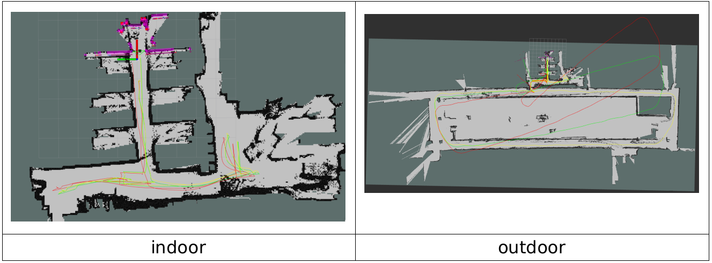

# 2DLIW-SLAM
[中文点我](https://github.com/LittleDang/2DLIW-SLAM/blob/main/README_cn.md)

## Introduction

This is a SLAM framework which tightly couples the data of 2D lidar, IMU and wheel odometry.

In addition, a lot of special processing has been done for the scene of indoor mobile robots:

* Ground constraints
* Some basic assumptions, such as roll and pitch are small
* Loop detection based on 2D lidar

Most of the work is focused on the design and implementation of the front-end part

The back-end part uses the pose graph, and the only innovation is to improve the paper published by the previous research ["Global Localization Method Based on Global Feature Point Matching"](https://kns.cnki.net/kcms2/article/abstract?v=3uoqIhG8C44YLTlOAiTRKu87-SJxoEJu6LL9TJzd50nS5QmOCQhBuPsjALI6Lv67j6KttBYx8CQ1P4eBo2UeDgakY4XEWQm3&uniplatform=NZKPT)proposed relocation algorithm, which is applied to loop closure detection.

## running result

### Video

[](https://www.bilibili.com/video/BV1K24y1E7eK/?vd_source=a2e7f1803695cee5e5b621196f5bc8f4)

### Actual scene

#### Indoor



> The effect of these two maps is a bit poor, mainly because the external parameters are not calibrated very accurately

### data set


> Dataset address: [OpenLORIS-Scene Datasets](https://shimo.im/docs/HhJj6XHYhdRQ6jjk/read)
> 
> PS: Remember to use it [official tool](https://github.com/lifelong-robotic-vision/openloris-scene-tools/blob/master/dataprocess/merge_imu_topics.py) to merge the IMU data.

### Install:

#### 1. Direct installation

```bash
cd ${yourworkspace}/src
git clone https://github.com/LittleDang/2DLIW-SLAM
cd ../..
catkin_make -j
```

#### 2. Install via docker

```bash
- Find the dockerfile under docker/, build images and containers

- Mount this project into

- Same as 1.
```

### QA:

1. Why do some parameters in the configuration file seem meaningless, such as `enable_camera` and the like?
   
   > Because the project has undergone many adjustments during the development process, some functions have been temporarily abandoned, but the code interface at the beginning is still retained, and the development may continue in the future.
   > 
   > Keep the default values for these unnecessary parameters.

2. Why is IMU selected as the coordinate system of the system?
   
   > I started writing this project without thinking clearly at the beginning. Later, I found out that this is true and will bring some inconvenient places. For example, the processing of a large number of places is not in the IMU coordinate system. I should choose to use base_link as the next time. The coordinate system of the system.

3. Why is the warehouse called 2DLIW-SLAM, but the code is called LVIO-2D
   
   > Because I only wanted to do a front-end at the beginning, and didn't think about doing a back-end, but then I added the back-end part for the integrity of the system and the integrity of the graduation thesis.

4. How to obtain the external reference?
   
   > I don’t have a particularly good method either. Some of them come with the sensor, and some are calibrated in a tortuous way under supervision. Generally speaking, the accuracy is not very high, which also leads to In some cases, the error of the system will be relatively large. (**Although it is very important, the external parameters of the data set already exist and the calibration of external parameters is not the focus of this paper, so I have not studied it carefully**)

5. Where is the  **paper?**
   
   > This will wait until I finish my graduation defense. At present, only papers related to loopback detection have been published.
   > 
   > ["Global Localization Method Based on Global Feature Point Matching"](doc/基于全局特征点匹配的全局定位方法.pdf)

## Some reasons for writing this framework

* From the first time I came into contact with SLAM in my junior year, and now I have graduated with a master’s degree, I have been thinking about **writing** a SLAM framework from scratch. I want to complete this matter before graduation, and it is also a souvenir. No major results were achieved during the research period.

* After reading the codes of excellent open source projects such as VINS-MONO, Cartographer, and LIO-SAM (the first two frameworks have had a great influence on me, thanks to the dedication of these authors, I also want to open source hhh), I also Gradually, I started to write a framework to achieve the functions I wanted according to my own understanding, so I took this long-conceived SLAM framework as my preparation for my master's graduation project (it can be said that I want to do this framework first, and then write it by the way. graduation thesis).

## Some thoughts

* I also experienced many problems during the implementation process. The biggest one is that I was planning to integrate the monocular camera at the beginning, but due to the workload considerations, I gave up halfway through the project. I bought a monocular camera (the workload was too much for me alone, and I was afraid that I would not be able to finish it on time...), you can see that many designs in my code still considered the sensor of the camera at the beginning. In the future, if there is a chance, you may consider improving it and let it evolve into 2DLVIW-SLAM

* **Of course, in terms of code implementation and theory, it may be immature or even wrong. If you find it, please discuss it with me. I am happy to accept amendments.**

* Finally, job hunting. . .

## License

[Apache-2.0 license](https://github.com/LittleDang/2DLIW-SLAM/blob/main/LICENSE)

Email: brucedang2022@163.com
